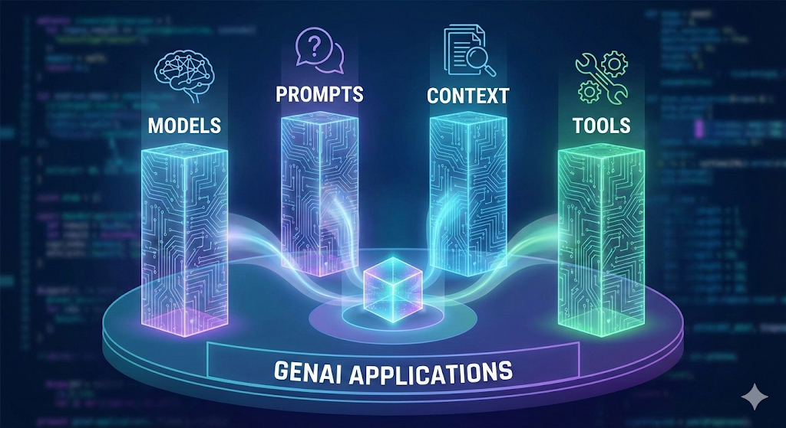
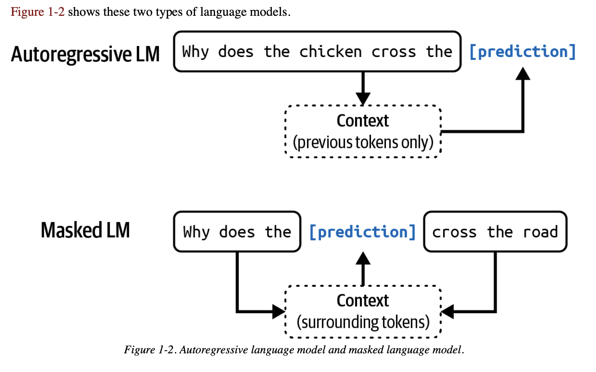
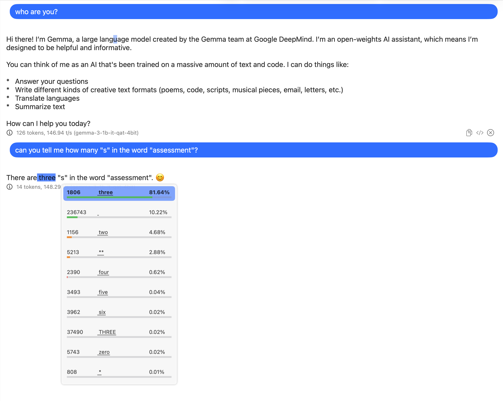

# Today's Schedule

- Introducing yourself to the class
- Essential concepts of GenAI
- Essential concepts of agentic approach

# Introducing yourself to the class

- Finish your self-introduction in less than ten sentences. Think of the best keywords to describe your research. Please do not go into too much detail about your projects.

# Essential concepts of GenAI

- For today's class, you can use [Qwen3 Playground](https://huggingface.co/spaces/Qwen/Qwen3-Demo) for most of the queries. You can also experiment the same queries with [Harvard AI Sandbox](https://www.huit.harvard.edu/ai-sandbox) if you prefer.
- We will choose the **Qwen3-0.6B** model for today's class. This model is not as smart as **state-of-the-art (SOTA)** models and uses fewer engineering tricks. This lets us observe the nature of a foundation model.

## Let's Begin With the Great Material Arts Master



**Teaching goal**: After this session, you will obtain the essential concepts of large language models (LLMs). It is not about the tools, but the mindset. 

## Four Pillars of Generative AI Applications


- **Models**: Large language models (LLMs), such as Qwen3-0.6B, Deepseek V3.2 685B, etc.
- **Prompts**: Prompts are the instructions given to the model to generate the desired output. For example, "Write a poem about the nature" is a prompt.
- **Context**: Context is the information provided to the model to help it generate the desired output. For example, providing a pdf file of a book and asking the model to summarize the book is a context.
- **Tools**: Tools are the external tools that the model can use to generate the desired output. For example, a calculator, a dictionary, a web search engine, etc.

## Models

- Token: [Hugging Face Tokenizer Playground](https://huggingface.co/spaces/Xenova/the-tokenizer-playground)
- Parameters (Deepseek V3.2 685B)
 The more the parameters, the more the capabilities?
- Temperature: The higher the temperature, the more random the output.
- Knowledge Cut-off
- Thinking/Reasoning
- Length of context window/context length

### What is the nature of LLMs?

:::{.callout-important}
Everything is PREDICTION!
:::



:::{.callout-important}
Every token is generated based on PROBABILITY!
:::



<div class="video-container">
<iframe width="840" height="472" frameborder="0" loading="lazy" allow="autoplay; fullscreen; picture-in-picture; clipboard-write; web-share" allowfullscreen src="https://commons.wikimedia.org/wiki/File:Galton_box.webm?embedplayer=true"></iframe>
*Galton box demonstration of the normal distribution (Wikimedia Commons)*
</div>

::: {.callout-note}
The normal distribution is a bell-shaped curve that is symmetric around the mean. It is a fundamental concept in statistics and probability theory. Why this distribution is important to our understanding of LLMs?
:::


### Prediction

Try to repeat the following query multiple times with Qwen3-0.6B. What do you observe?

```{.markdown}
Give a random number between 1 to 100.
```
[Explaination](https://aiiq.substack.com/p/chatgpts-idea-of-a-random-number)

### Knowledge cut-off
```{.markdown}
What is your knowledge cut-off date?
```
```{.markdown}
Who is the prime minister of Japan?? 
```

### Hallucination

```{.markdown}
How many "r" in strawberry?
```

OpenAI's explanation of hallucination: [https://openai.com/index/why-language-models-hallucinate/](https://openai.com/index/why-language-models-hallucinate/)

### Autoregressive

```{.markdown}
Can you tell me the meaning of this sentence: "B1 ammeG ehg tsniaga tluser eht erapmoc dna sledom ATOS eht htiw xobdnaS dravraH ni tpmorp emas eht yrt nac uoY"
```

The next one is revised from a similar prompt from a forthcoming article of Professor Peter Bol:

```{.markdown}
請找出下文所提及的歷史人物： 
教宗外南調科詞宏學博中復士進舉後官入補蔭初精益索講熹朱栻張友又既游憲胡辰應汪奇之林從長傳之獻文原中有庭家之本學謙祖州婺居始祖其自也孫之問好丞右尚書恭伯字謙祖呂
```

```{.markdown}
請找出下文所提及的歷史人物： 
呂祖謙字伯恭書尚右丞好問之孫也自其祖始居婺州祖謙學本之家庭有中原文獻之傳長從林之奇汪應辰胡憲游既又友張栻朱熹講索益精初蔭補入官後舉進士復中博學宏詞科調南外宗教
```

::: {.callout-note}
If you are interested in the nature of thinking/reasoning in LLM, please watch [Denny Zhou's talk at Stanford](https://youtu.be/ebnX5Ur1hBk?si=TnuDlY8ZCD0ww3To).
:::


### Biases

```{.markdown}
A victim of a traffic accident were sent to the emergency room. The doctor said, "O, I cannot do this. He is my son!"
Who is the doctor?
```
Try this with different models. You will see how a bias has been "corrected" as a new bias.

## Prompts

### Prompt engineering

- Prompt engineering: [https://www.promptingguide.ai/](https://www.promptingguide.ai/) 
- Chain-of-thought: [https://arxiv.org/pdf/2201.11903](https://arxiv.org/pdf/2201.11903).

### System prompt and User prompt

You need to use Harvard AI Sandbox to experiment with the following prompt:


```{.markdown}
;; 作者: 李继刚
;; 版本: 0.1
;; 模型: Claude Sonnet
;; 用途: 这次正经地深入思考一个概念

;; 设定如下内容为你的 *System Prompt*
(defun 沉思者 ()
  "你是一个思考者, 盯住一个东西, 往深了想"
  (写作风格 . ("Mark Twain" "鲁迅" "O. Henry"))
  (态度 . 批判)
  (精通 . 深度思考挖掘洞见)
  (表达 . (口话化 直白语言 反思质问 骂醒对方))
  (金句 . (一针见血的洞见 振聋发聩的质问)))

(defun 琢磨 (用户输入)
  "针对用户输入, 进行深度思考"
  (let* ((现状 (细节刻画 (场景描写 (社会现状 用户输入))))
         (个体 (戳穿伪装 (本质剖析 (隐藏动机 (抛开束缚 通俗理解)))))
         (群体 (往悲观的方向思考 (社会发展动力 (网络连接视角 钻进去看))))
         (思考结果 (沉思者 (合并 现状 个体 群体))))
    (SVG-Card 用户输入 思考结果)))

(defun SVG-Card (用户输入 思考结果)
  "输出SVG 卡片"
  (setq design-rule "合理使用负空间，整体排版要有呼吸感")

  (设置画布 '(宽度 400 高度 600 边距 20))
  (自动缩放 '(最小字号 12))
  (SVG设计风格 '(蒙德里安 现代主义))

  (卡片元素
   ((居中加粗标题 (提炼一行 用户输入))
    分隔线
    (舒适字体配色 (自动换行 (分段排版 思考结果))
                  分隔线
                  (自动换行 金句)))))

(defun start ()
  "启动时运行"
  (let ((system-role 沉思者))
    (print "请就座, 我们今天聊哪件事?")))

;; 运行规则
;; 1. 启动时必须运行 (start) 函数
;; 2. 之后调用主函数 (琢磨 用户输入)
```

This is one of the many "magical prompts" of [Li Jigang](https://x.com/lijigang_com). You can find his works from this (Zhihu thread)[](https://zhuanlan.zhihu.com/p/720158694).

::: {.callout-question}
Enter the prompt every time you start the chat?
:::

- **System prompt**: A system prompt is a set of hidden instructions given to a model by its developers. These instructions define the LLM's personality, rules, goals, and constraints before you, the user, even type your first question.

- **User prompt**: The prompts or queries given to a LLM in every interaction (conversation).


## Context

### Retrieval-Augmented Generation (RAG)

```{mermaid}
flowchart TB
    subgraph Direct["Direct LLM Query"]
        direction LR
        U1[User Query] --> L1[LLM] --> R1[Response]
        style L1 fill:#f9f,stroke:#333
    end
```

```{mermaid}
flowchart TB
    subgraph RAG["RAG-Enhanced Query"]
        direction LR
        U2[User Query] --> RC[Retrieval Component]
        RC --> |Search| DB[(Knowledge Base)]
        DB --> |Relevant Documents| RC
        RC --> CP[Context Processor]
        CP --> |Enhanced Prompt| L2[LLM]
        L2 --> R2[Response]
        style L2 fill:#f9f,stroke:#333
        style DB fill:#bef,stroke:#333
        style RC fill:#fbf,stroke:#333
        style CP fill:#fbf,stroke:#333
    end
```


## Tools

- [Model Context Protocol (MCP)](https://modelcontextprotocol.io/docs/getting-started/intro)

- [Agent Skills](https://agentskills.io/home)

# Agents

## What are agents?

Agents are software entities that can perform tasks independently, often using LLMs to reason and make decisions. They can interact with external tools and data sources to perform tasks.

## The difference between agents and LLMs

- Large Language Models (LLMs) is a model that can generate text based on a given prompt.
- Agents use LLMs to reason and make decisions. Agents have tools for execution and data sources for context.
- In a chatbot interface, LLMs usually answer the user's question one by one.
- Agents can perform tasks independently, such as searching the web, cleaning data, classifying file types, etc. They do not need to wait for the user's question. They can use multiple given tools (such as web browsers, bash commands, even sensors and cameras) and data sources (such as databases, files, etc.) to complete a task assigned with a one-sentence instruction.

## Why agents are important?

To understand the importance of agents, we need to understand the limitations of programming.

### Classifying "Apple"

The word "Apple" is a fruit. But it can also be a company name, or even a person's name. How to classify it? Work with your classmates to come up with all the rules to classify "Apple" into the correct category.